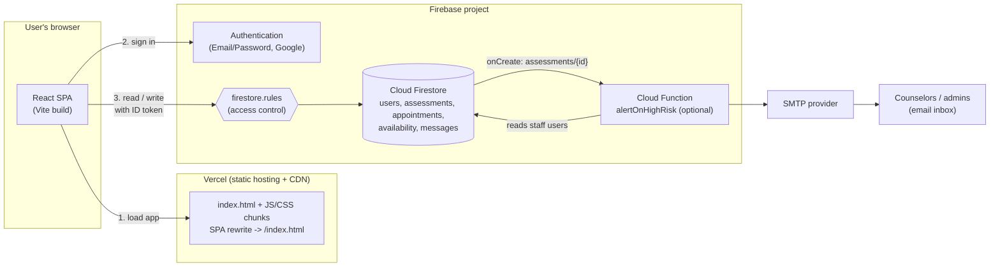
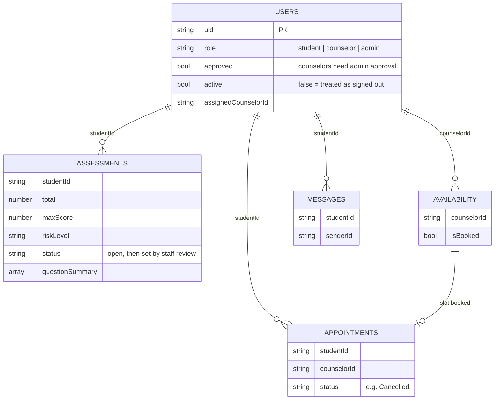
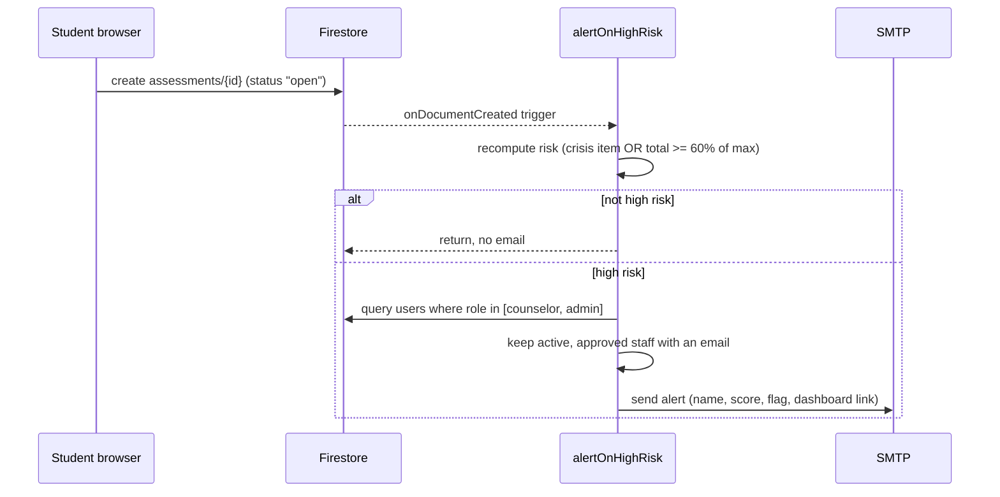

# Mind Bridge architecture

This document explains how the system is put together, how data and access flow through it, and
where it will strain as usage grows. For setup and release steps see
[`DEPLOYMENT.md`](DEPLOYMENT.md). For the operation-by-operation reference see [`API.md`](API.md).

## 1. System overview

Mind Bridge is a **serverless single-page app**. There is no application server. The browser talks
directly to Firebase, and Firestore security rules are the only server-side gate for data access. A
single optional Cloud Function sends email alerts.



The same picture as plain text:

```
 Browser (React SPA) ──load──▶ Vercel CDN (static files)
        │
        ├──sign in──▶ Firebase Auth
        │
        └──read/write (ID token)──▶ firestore.rules ──▶ Cloud Firestore
                                                           │ onCreate assessments/{id}
                                                           ▼
                                                  Cloud Function ──▶ SMTP ──▶ staff email
```

### Design decisions

| Decision | Reason | Cost |
|---|---|---|
| No custom backend | Smallest surface to run and secure for a student project; Firebase handles auth, storage and scaling | Business rules live in client code and in `firestore.rules` |
| Firestore rules as the access layer | Enforced server-side regardless of what the client does | Rules are hard to unit test, so there is a dedicated emulator suite in `backend-tests/` |
| Lazy-loaded routes and vendor chunks | Initial JS is about 82 kB; Firebase and Recharts load on demand | Slightly more build configuration (`vite.config.js`) |
| Rule-based risk scoring | Transparent and explainable to counselors | Needs clinical validation; see the README notes |
| Function recomputes risk server-side | The email never trusts the client-supplied `riskLevel` | Scoring logic exists in two places (`scoring.js` and `functions/index.js`) and must be kept in sync |

## 2. Frontend architecture

```
main.jsx -> ErrorBoundary -> App.jsx (lazy routes) -> AuthContext -> DashboardLayout / PublicShell
                                                           │
pages & features ──▶ lib/api.js ──▶ lib/firebase.js ──▶ Firebase SDK
```

| Layer | Location | Responsibility |
|---|---|---|
| Routing | `src/App.jsx` | Lazy-loaded routes, auth and role redirects |
| Auth state | `src/context/AuthContext.jsx` | Current user, role, approval and active flags |
| Data access | `src/lib/api.js` | The only module that calls Firestore; everything else imports from it |
| Business logic | `src/lib/scoring.js`, `validation.js`, `errors.js`, `dates.js` | Pure functions, covered by unit tests |
| UI primitives | `src/components/ui/` | Shared components with Storybook stories |
| Features | `src/features/{student,appointments,staff,settings,chat}` | One folder per user-facing area |

Keeping every Firestore call in `lib/api.js` is deliberate: it is the seam used by the unit tests,
and the Playwright suite replaces the whole Firebase SDK with in-memory fakes at the Vite alias
level (`vite --mode e2e`).

## 3. Data model



Field lists are abbreviated to those the rules and function depend on. The full shapes are in
`client/src/lib/api.js`.

## 4. Security model

### Access matrix (enforced by `firestore.rules`)

| Collection | Student | Counselor (approved) | Admin |
|---|---|---|---|
| `users` | Read and edit own profile (not role, approval, active, assignment) | Read all; set student assignment fields | Read and update all |
| `assessments` | Create own (`status: "open"`), read own | Read and update all | Same as counselor |
| `appointments` | Create own, read own, cancel own | Read and update all | Same as counselor |
| `availability` | Read all, flip `isBooked` only | Create and delete own, update | Same as counselor |
| `messages` | Create and read own thread | Create and read all | Same as counselor |
| anything else | Denied | Denied | Denied |

Deletes are denied everywhere except availability slots. Deactivated users (`active: false`) are
denied on every collection.

### Trust boundaries and known gaps

- **Client is untrusted.** Role, approval and active flags cannot be self-edited; the rules check
  the stored profile, not anything the client sends.
- **Email domain is enforced in the UI only.** `Signup.jsx` and `Login.jsx` reject non-`@usa.edu.ph`
  accounts, but the rules do not check the domain. Someone calling the Firebase API directly could
  create a student account with another email. If that matters, add a domain check to the `users`
  create rule or use a blocking Auth function.
- **Firebase web config is public by design.** `VITE_FIREBASE_*` values ship in the bundle. They
  identify the project; they do not grant access. The rules do.
- **The rules file is headed "DRAFT".** It is covered by the emulator tests but should be reviewed
  against real data before a production launch.
- **Alert emails contain no answers.** Only the student name, score and flag are sent; detail stays
  in the app.

## 5. Alert pipeline



If the SMTP send fails, the error is logged and no email is sent: the function does not enable
retries. See [scaling](#6-scaling-considerations).

## 6. Scaling considerations

The current design comfortably serves a single campus pilot. These are the pressure points, in the
order they are likely to matter.

| Area | Current behavior | Risk at scale | Mitigation |
|---|---|---|---|
| **Staff dashboards** | `getAssessments`, `getAllAppointments`, `getAdminUsers` fetch whole collections and join users in the browser | Read cost and load time grow linearly with total records; every dashboard open re-reads everything | Paginate with `limit()` and cursors, filter server-side by `status`, and cache the user lookup |
| **Firestore reads** | Billed per document read, and rules that call `get()` add a read per request | Cost grows with traffic; each rule check on `users/{uid}` is an extra read | Keep rules' `me()` lookups minimal; consider custom claims for role so rules need no extra read |
| **Hot documents** | Writes are spread across many documents | None expected; the 1 write/second/document soft limit is not approached | Avoid counters on a single document if metrics are added; use sharded counters |
| **Booking race** | A slot is booked by flipping `isBooked`; two students could attempt the same slot at once | Double booking | Move booking into a Firestore transaction or a callable function that checks and sets atomically |
| **Chat** | One `onSnapshot` listener per open chat | Listener count equals concurrent chats; Firestore supports this well but each update is a read | Limit history with `limit()`; detach listeners on close (already done on unmount) |
| **Alerts** | One email per high-risk assessment, sent synchronously from the trigger | Burst of submissions could hit SMTP rate limits; a failure is silently lost | Enable function retries, batch into a digest, or use a transactional email API |
| **Function cold start** | Node 20 function scales to zero | First alert after idle is slower by a second or two | Acceptable for alerts; set `minInstances: 1` only if latency matters |
| **Static hosting** | Vercel CDN serves hashed, long-cached chunks | Not a bottleneck | Already split into `firebase`, `charts` and route chunks |
| **Indexes** | All queries are single-field equality (`studentId`, `counselorId`, `role in`), so no composite indexes exist | New multi-field queries or `orderBy` will fail until an index is created | Add `firestore.indexes.json` and deploy it when such a query is introduced |

Cost note: Firebase's Spark plan covers the client, Auth and Firestore at pilot volume. The alert
function needs the Blaze plan (pay as you go), which still costs close to nothing at this volume.
Set a budget alert in Google Cloud when moving to Blaze.

## 7. Observability

| Signal | Where |
|---|---|
| Frontend runtime errors | `ErrorBoundary` shows a recovery screen; errors are logged to the browser console |
| Hosting and build logs | Vercel dashboard, Deployments tab |
| Function logs | Firebase console, Functions, Logs (or `firebase functions:log`) |
| Auth events | Firebase console, Authentication |
| Rule denials | Firebase console, Firestore, Usage; or Cloud Logging for Firestore requests when enabled |

There is no application performance monitoring or error aggregation service yet. Adding an error-reporting
service such as Sentry is the logical next step.
