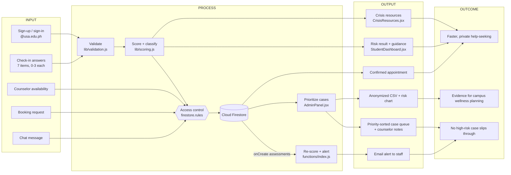

# Mind Bridge: IPOO framework implementation

This document maps the **Input, Process, Output, Outcome (IPOO)** conceptual framework onto the
code. It also documents the risk-scoring algorithm, the data-security measures, and where each
objective is implemented.

> **Note on the proposal.** The project proposal is not stored in this repository, so the IPOO
> wording and objective numbering below are derived from the product definition in
> [`PRODUCT.md`](../PRODUCT.md) and from the code. Section 5 has a column to align each row with the
> proposal's exact objective text before submission. Every file path and behavior described here was
> read from the code, not assumed.

## 1. IPOO at a glance

| Stage | Question it answers | In Mind Bridge |
|---|---|---|
| **Input** | What goes in? | Student identity (`@usa.edu.ph` account), seven check-in answers scored 0 to 3, counselor availability, appointment requests, chat messages |
| **Process** | What do we do with it? | Validate, score against the risk rules, store under role-based rules, flag and prioritize, alert staff, match to appointments |
| **Output** | What comes out? | A risk level with guidance for the student, a prioritized case queue for counselors, booked appointments, an email alert, anonymized reports |
| **Outcome** | What changes for people? | Students reach support sooner and privately; high-risk cases are not missed; counselors triage faster; the campus sees aggregate wellness trends |

## 2. System architecture and data flow



Plain-text version of the main path:

```
INPUT                PROCESS                                   OUTPUT                      OUTCOME
-----                -------                                   ------                      -------
7 answers (0-3) ──▶ validate ─▶ scoreAnswers() ─▶ rules gate ─▶ risk level + guidance ───▶ student gets help
                                     │                │         crisis resources             sooner, privately
                                     ▼                ▼
                              riskLevel, total   Firestore ──▶ priority-sorted case queue ─▶ counselors triage
                              flaggedForImmediate     │                                      the urgent first
                              Review                  └──────▶ Cloud Function re-scores ───▶ high-risk email ─▶ no case missed
                                                      └──────▶ anonymized CSV / chart ─────▶ campus planning
```

For infrastructure (Vercel, Firebase, trust boundaries) see [`ARCHITECTURE.md`](ARCHITECTURE.md).

## 3. Risk-scoring algorithm

Source of truth: [`client/src/lib/scoring.js`](../client/src/lib/scoring.js). The Cloud Function
(`functions/index.js`, `assess()`) applies the same rules independently.

### 3.1 The instrument

Seven items, each answered **0 to 3**, covering the last two weeks. The questions are defined in
`client/src/features/student/StudentDashboard.jsx`.

| # | Item | Domain | Crisis item |
|---|---|---|---|
| 1 | Little interest or pleasure in academic or daily activities | Mood / anhedonia | No |
| 2 | Feeling down, depressed, overwhelmed, or hopeless | Mood | No |
| 3 | Trouble falling or staying asleep, or sleeping excessively | Sleep | No |
| 4 | Feeling nervous, anxious, or constantly on edge | Anxiety | No |
| 5 | Not being able to stop or control worrying | Anxiety | No |
| 6 | Trouble concentrating on lectures, schoolwork, or reading | Focus | No |
| 7 | Thoughts that you would be better off not around, or hurting yourself | Safety | **Yes** |

The items follow the style of the PHQ-9 and GAD-7 screening questionnaires (a 0 to 3 frequency
scale). It is a shortened, adapted instrument and has not been clinically validated.

### 3.2 Calculation

```
total     = sum of all answers            (null or missing counts as 0)
maxScore  = number of questions × 3       (7 × 3 = 21)
crisis    = any crisis item with a score > 0

riskLevel = "high"    if crisis  OR  total ≥ 60% of maxScore
          = "medium"  else if total ≥ 30% of maxScore
          = "low"     otherwise
```

### 3.3 Thresholds for the current 7-item form

Thresholds are percentages of the maximum, so they adjust automatically if questions are added or
removed. For the current form (max 21):

| Risk level | Rule | Total score | Student sees | Staff sees |
|---|---|---|---|---|
| **Low** | total below 30% | 0 to 6 | "Steady right now" | Normal queue position |
| **Medium** | total from 30% to under 60% | 7 to 12 | "Some stress is showing" | Ranked above low |
| **High** | total at least 60% | 13 to 21 | "Priority support suggested" | Top of queue, email alert |
| **High (override)** | crisis item above 0 | any, even 1 | Priority support, crisis resources | Top of queue, "Safety question flagged", email alert |

Exact cut-offs: 30% of 21 is 6.3, so 7 is the first medium score; 60% is 12.6, so 13 is the first
high score.

### 3.4 On "weighting"

The algorithm uses **two tiers, not per-item weights**:

1. **Equal weighting for items 1 to 6.** Each contributes 0 to 3 points to the total, and the total
   is compared against percentage thresholds.
2. **A safety override for item 7.** The crisis item is not weighted into the sum. Any answer above
   zero sets `flaggedForImmediateReview` and forces `high`, regardless of the total. This is a
   deliberate design choice: a single "sometimes" on a self-harm item matters more than the sum of
   the other six.

If the proposal specifies different weights per domain, they would be added in `scoreAnswers()` by
multiplying each answer by a weight before summing and scaling `maxScore` the same way. The tests
in `scoring.test.js` and `scoring.edge.test.js` would then need new boundary cases.

### 3.5 Worked examples

| Answers (items 1 to 7) | Total | Crisis | Result |
|---|---|---|---|
| 0, 0, 1, 0, 0, 1, 0 | 2 | no | Low |
| 1, 2, 1, 1, 1, 1, 0 | 7 | no | Medium (first medium score) |
| 2, 2, 2, 2, 2, 2, 0 | 12 | no | Medium (top of range) |
| 2, 2, 2, 2, 2, 3, 0 | 13 | no | High (first high score) |
| 0, 0, 0, 0, 0, 0, 1 | 1 | **yes** | High, immediate review |
| 3, 3, 3, 3, 3, 3, 3 | 21 | yes | High, immediate review |

### 3.6 Where the result is used

| Use | File |
|---|---|
| Compute and store the result | `scoring.js`, `api.js` `submitResponse()` |
| Student result and guidance copy | `StudentDashboard.jsx` |
| Trend versus previous check-in (points up, down, unchanged) | `StudentDashboard.jsx` |
| Queue order: safety-flagged, then high, medium, low; open before reviewed; newest first | `AdminPanel.jsx` |
| Re-score on the server and decide whether to email | `functions/index.js` `assess()` |
| Bar chart of low, medium and high counts | `AdminPanel.jsx` (Analytics tab) |

### 3.7 Limits

- The scoring is a **triage aid, not a diagnosis**. `PRODUCT.md` makes this a stated constraint, and
  a counselor or psychologist should validate the thresholds before clinical reliance.
- The duplicated rule in `functions/index.js` must be kept in sync with `scoring.js`. `scoring.js` carries a
  comment saying so, and `backend-tests/` covers the function side.
- `riskLevel` is stored as sent by the client and the rules do not recompute it. A tampered client
  could store a lower level on its own record, which would affect the staff queue order. The email
  alert is not affected, because the function recalculates from the raw scores. Server-side
  validation of the stored level would close this gap. This is recorded as a known gap in
  `backend-tests/rules/known-gaps.test.js`.

## 4. Data security and confidentiality

### 4.1 Measures in place

| Concern | Measure | Where |
|---|---|---|
| **Who can read what** | Role-based rules: students read only their own assessments, appointments and messages; staff read all; everything else is denied by default | `firestore.rules` |
| **Privilege escalation** | Users cannot change their own `role`, `approved`, `active` or counselor assignment. Admin is set only by hand in the console | `firestore.rules` (`users` update rule) |
| **Counselor vetting** | Counselors have no staff access until an admin sets `approved: true` | `isStaff()` in the rules |
| **Account shutdown** | `active: false` blocks every collection immediately | `isActive()` in the rules |
| **Impersonation** | Create rules require `studentId` / `senderId` to equal the caller's uid | `firestore.rules` |
| **Tampering with records** | No deletes (except availability slots); assessments updatable by staff only; messages immutable; students may only cancel their own appointment | `firestore.rules` |
| **Authentication** | Firebase Authentication handles credentials. Passwords are salted and hashed by Firebase and never reach our code or database. Google sign-in is limited to `@usa.edu.ph` in the UI | `Login.jsx`, `Signup.jsx` |
| **Data in transit and at rest** | HTTPS everywhere (Vercel and Firebase); Google encrypts Firestore data at rest | Platform |
| **Alert content** | The email contains name, score, and flag only; individual answers stay in the app | `functions/index.js` |
| **Output escaping** | Names are HTML-escaped before going into the email | `esc()` in `functions/index.js` |
| **Reporting privacy** | CSV export replaces names and emails with sequential ids (`ST-0001`) and exports only risk, status, score and dates | `adminUtils.js` |
| **Secrets** | SMTP credentials are a Firebase secret, never in the client bundle; `.env*` is git-ignored | `functions/index.js`, `.gitignore` |
| **Error leakage** | Raw Firebase errors are never shown; they are translated to plain sentences | `lib/errors.js` |
| **Consent and transparency** | Cookie consent banner, privacy policy, terms, and a non-diagnostic disclaimer | `CookieConsent.jsx`, `PrivacyPolicy.jsx`, `TermsAndConditions.jsx` |
| **Verified by tests** | Rule outcomes (allow and deny per role) are asserted against the Firestore emulator | `backend-tests/rules/` |

### 4.2 Known gaps (stated plainly)

| Gap | Impact | Suggested fix |
|---|---|---|
| Email domain is enforced in the UI only, not in the rules | A direct API caller could register a non-school account | Domain check in the `users` create rule or a blocking Auth function |
| Students can read their own whole assessment document, including `counselorNotes` | A student could see clinical notes the UI hides from them | Move notes to a staff-only subcollection or collection |
| Staff can read every student's data, with no assignment scoping | Any approved counselor sees all students | Restrict reads to the assigned counselor, using `assignedCounselorId` |
| The assessment stores `studentEmail` and `studentName` next to the answers | More identifying data than reporting needs | Keep identity in `users` and join on read |
| A student can create an appointment already marked `Confirmed`, free another student's slot, or post a message labelled `senderRole: "counselor"` | Students can write fields that should be server-controlled (asserted in `known-gaps.test.js`) | Constrain these fields in the create and update rules, or move booking into a callable function |
| `firestore.rules` is marked DRAFT | Needs a review against production data | Review, then remove the DRAFT header |
| No audit log of who viewed a case | Cannot answer "who accessed this record" | Cloud Function or Firestore audit logging |
| No data-retention schedule | Records are kept indefinitely | Define retention and scheduled deletion with the counseling office |
| The privacy policy says "encrypted at rest" | True of the platform defaults, but this app adds no field-level encryption | Keep the wording tied to the platform, or add field-level encryption for notes |
| `PRODUCT.md` mentions "bcrypt session security" | Firebase uses its own hashing and tokens, not bcrypt | Update the wording to "Firebase Authentication" |

The email-domain, counselor-notes and staff-scoping gaps are the most relevant to confidentiality and would be the priority before a real
launch.

## 5. Objectives mapped to implementation

Replace the "Proposal objective" wording with the exact text from the proposal. The mapping to
code stays the same.

| # | Objective (aligned to `PRODUCT.md`) | Stage | Implemented in | Verified by |
|---|---|---|---|---|
| 1 | Provide a **safe, private self-assessment** of mood, stress, sleep, focus and safety | Input | `StudentDashboard.jsx` (7-item form, crisis item), `validation.js` | `scoring*.test.js`, `e2e/assessment.spec.js` |
| 2 | **Evaluate risk** objectively with a multi-tier result | Process | `lib/scoring.js`, `api.js` `submitResponse()` | `scoring.test.js`, `scoring.edge.test.js`, `api.test.js` |
| 3 | Give **immediate, actionable guidance** and crisis resources | Output | Result card in `StudentDashboard.jsx`, `CrisisResources.jsx` | `e2e/results.spec.js`, `e2e/crisis-resources.spec.js` |
| 4 | Let counselors **triage flagged cases first** and record notes | Process / Output | `AdminPanel.jsx` (filters, priority sort, status, notes) | `e2e/counselor.spec.js` |
| 5 | **Notify staff** when a high-risk check-in arrives | Output | `functions/index.js` `alertOnHighRisk` (not yet deployed) | `backend-tests/functions/alertOnHighRisk.test.js` |
| 6 | **Book and manage appointments** with counselors | Process / Output | `BookingFlow.jsx`, `Appointments.jsx`, `ManageAvailability.jsx`, `api.js` | `backend-tests/api/api.test.js` |
| 7 | **Confidential communication** between student and counselor | Input / Output | `ConfidentialChatModal.jsx`, `api.js` (`listenToStudentMessages`, `sendStudentMessage`), `messages` rules | `backend-tests/rules/scheduling.test.js`, `known-gaps.test.js` (partial) |
| 8 | **Role-based access and governance** (approve counselors, deactivate users) | Process | `AuthContext.jsx`, `AdminPanel.jsx`, `firestore.rules` | `backend-tests/rules/users.test.js` |
| 9 | **Protect privacy** of sensitive data | Process | Section 4 above | `backend-tests/rules/assessments.test.js`, `users.test.js` |
| 10 | **Aggregate insight** for wellness planning | Output / Outcome | Analytics tab and anonymized CSV in `AdminPanel.jsx`, `adminUtils.js` | No automated test yet |
| 11 | **Accessible, calm** experience under stress | Output | `theme.css` tokens, `Modal`, `useFocusTrap`, 44px targets, reduced motion | Storybook a11y addon, `DESIGN.md` |

## 6. How each stage flows: end to end

**Scenario: a student submits a high-risk check-in.**

1. **Input.** The student signs in with an `@usa.edu.ph` account (`AuthContext`) and answers the seven
   items. Item 7 is answered "several days" (2).
2. **Process, client.** `scoreAnswers()` computes the total, sees the crisis item above zero, and sets
   `riskLevel: "high"` and `flaggedForImmediateReview: true`. `submitResponse()` builds the record
   (`status: "open"`) and writes it to `assessments`.
3. **Process, gate.** `firestore.rules` checks the caller is active, that `studentId` equals their
   uid, and that `status` is `"open"`. Otherwise the write is rejected.
4. **Output, student.** The student immediately sees "Priority support suggested", the explanation
   that guidance staff will review in confidence, and the crisis hotlines. They can book a counselor.
5. **Process, server.** The `assessments` create event triggers `alertOnHighRisk`, which recomputes
   risk from the raw scores (not the stored level), finds active, approved staff, and emails them
   the name, score and flag, with a dashboard link.
6. **Output, staff.** In the admin panel the case sits at the top of the queue with a "Safety
   question flagged" badge. The counselor opens it, reads the responses, adds notes, and sets the
   status to `reviewed` or `escalated`.
7. **Outcome.** The student is connected to a counselor quickly and privately, and the case was not
   dependent on someone happening to check a dashboard. In aggregate, the anonymized export and risk
   chart show how many students fall in each tier over time.

**Feedback loop.** Outcomes feed back into Input: the trend line compares each new check-in with the
previous one ("improving", "higher distress", "unchanged"), and counselor status changes update what
the next staff member sees.

## 7. Suggested measures for the Outcome stage

The code produces the data needed to evaluate whether the outcomes are being met. These are not
computed in the app today, except the first.

| Outcome | Indicator | Source |
|---|---|---|
| No high-risk case missed | Share of high-risk assessments moved out of `open` within an agreed time | `createdAt`, `reviewedAt`, `status` on `assessments` |
| Faster help-seeking | Time from high-risk result to booked appointment | `assessments.createdAt` and `appointments` |
| Engagement | Check-ins per student, repeat usage | `assessments` by `studentId` |
| Campus picture | Low, medium, high distribution over time | Analytics tab (shown today) and CSV export |
